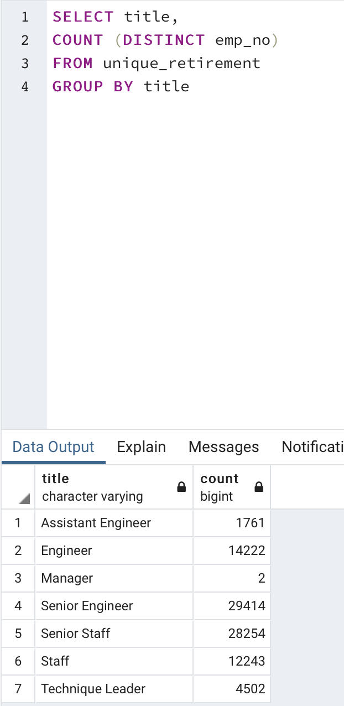
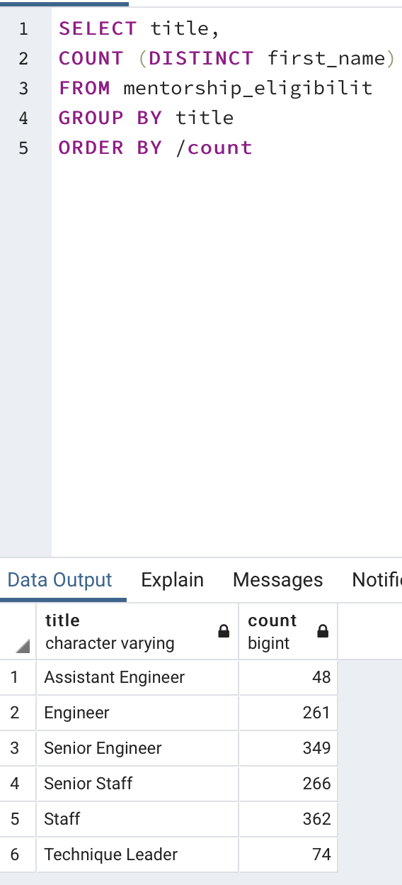

# Pewlett-Hackard-Analysis
## Project Overview
For this project we focused on gathering information about the employees of Pewlett Hackard and storing it into a Postgres SQL database. When all the data was stored inside the database we then ran a series of queries to extract relevant data, such as the number of employees close to retirement, their titles, and the people that might replace them. We separtaed this information into seperate tables in the databse and then extracted them so we could send them in a csv format. 
## Deliverable 1 Analysis
The first deliverable was to capture the data surrounding employees nearing retirement as well as the title of each employee. 
* We found that more senior engineers than any other title were gearing up for retirement. 
* We also found that there were very few managers nearing retirement, which is posititve, as there will still be people left to train the new wave of employees.
## Deliverable 2 Analysis
The second deliverable was to capture the data surrounding employees that are eligible for mentorship, before the retirment of their superiors.
* We found that there are 1549 empoloyees eligible for mentorship.
* After discovering this, it was made clear that there were not enough current employees to replace the wave of retireees.
## Summary
* The query below shows how many roles that will need to be filled. 

* No, there are not enough employees. As we can see from the mentorship eligiblity table we created and the query ran below, there are not nearly enough employees.

